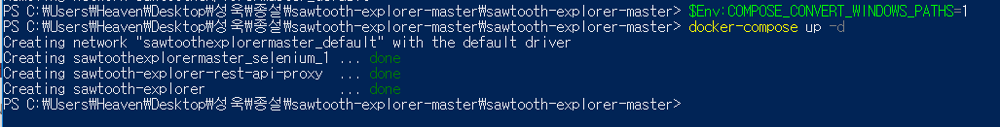
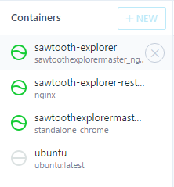
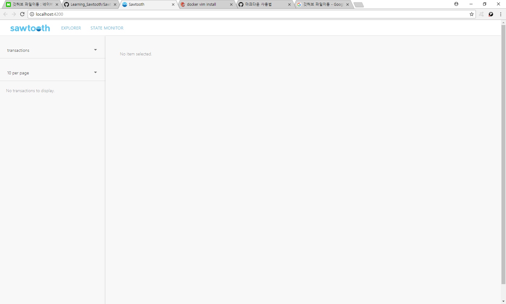

소투스 익스플로러! - 소투스 익스플로러 설치
=============
### 필자는 Window10 / docker 18.03.0-ce-win59 버전을 사용 하였습니다.

도커를 실행시켜 주세요. 그리고
먼저 이곳에서 파일을 다운 받아주세요. 
> <https://github.com/hyperledger/sawtooth-explorer>

다운로드를 하신 뒤 압축을 푸시고 
그 폴더에 들어가신 뒤, Shift + 마우스 우클릭을 통해서 파워쉘을 열어주세요. 
다음 명령어를 입력하셔서 도커에 컨테이너를 설치합니다. 
압축을 푼 폴더에 있는 내용들이 도커 리눅스 컨테이너에 올라가는 것이므로, 올리고 도커에서 수정할 필요 없이 파일을 수정해서 올리는 것이 좋습니다.
도커에서 굳이 수정하시려면, <http://blog.hemapresso.com/?p=715> 를 참조하여 vim을 깔고 수정하세요.(~~근데 그냥 하지마세요~~)
> docker-compose up

**이때 모든 컨테이너가 제대로 설치되지 않는다면**
> $Env:COMPOSE_CONVERT_WINDOWS_PATHS=1

를 입력하신 뒤 

> docker-compose down 

위 명령어는 컨테이너를 삭제하는 명령어입니다. 
> docker-compose up -d

를 순서대로 입력하시면 오류 없이 실행될 것입니다. 
또한, Ctrl + c 를 통해서 언제든 실행 중인 컨테이너를 멈출 수 있습니다!

제대로 설치되었다면, 다음 그림과 같이 나와야 합니다. 

하나라도 error 가 나면 제대로 되지 않은 것입니다.
또한 Kitematic을 통해서 설치된 컨테이너를 봤을 때, 다음과 같아야 합니다.

세 가지의 컨테이너가 정상적으로 설치되어야 합니다.
다음으로, 
> http://localhost:4200/ 

로 접속해 보세요. 

이 화면이 뜬다면 제대로 깔린 것입니다. 

다음 편은 블록체인을 실행시키고 트랜잭션을 보는 방법을 알려드립니다. 

[다음편](./Sawtooth-explorer2.md)
