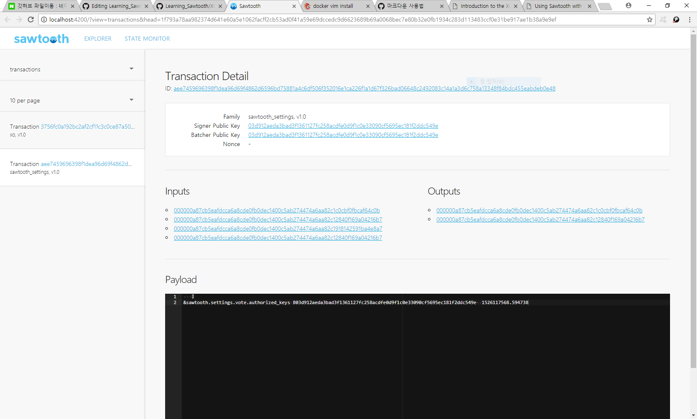
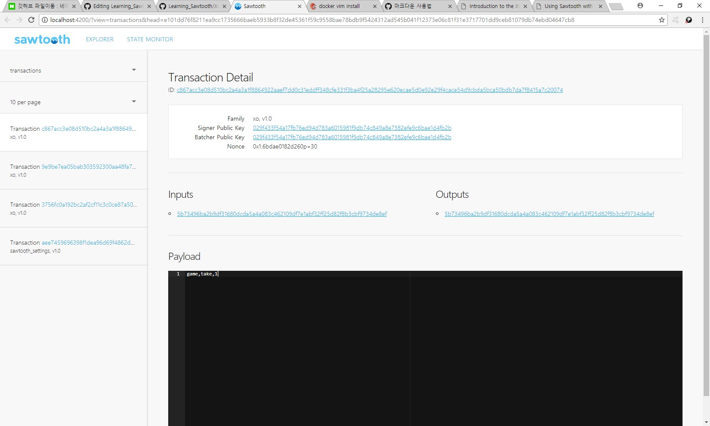

소투스 익스플로러! - 소투스 익스플로러에서 트랜잭션 보기 
=============
### 필자는 Window10 / docker 18.03.0-ce-win59 버전을 사용 하였습니다.

이전에 틱택토 트랜지션 뷰를 보는 방법을 설명 했습니다. 
다음으로 State monitor를 열고 관찰하는 방법을 설명드립니다. 

[XO게임 다운로드와 명령어 설명](https://github.com/GRuuuuu/Learning_Sawtooth/blob/master/sawtooth/sawtooth%20running%20%232/XO%20Transaction%20Family.md)

[Yaml파일은 여기](https://sawtooth.hyperledger.org/docs/core/releases/1.0/app_developers_guide/sawtooth-default.yaml)

이전 버전에서 다 보여드렸으니 알아서 익스플로러를 실행하세요. 
그리고 트랜잭션 뷰를 보시면 input과 output 이라는 부분이 있습니다. 
이것이 무엇일까요? 머클 트리의 어드레스입니다. 머클 트리에 트랜잭션을 저장하는데, 이곳이 글로벌 스테이트입니다.
자세한 설명은 이곳을 참조하세요 : 
<https://sawtooth.hyperledger.org/docs/core/releases/1.0/architecture/global_state.html?highlight=state>

한 XO게임이 생성되면, 글로벌 스테이트가 생기는데
이 곳의 주소입니다. 한 XO게임의 트랜잭션 정보를 보면 - input, output은 모두 동일합니다. 
같은 머클 트리의 스테이트에 속하기 때문입니다!
따라서 입력해야 하는 스테이트 어드레스는, 인풋의 주소입니다. -> 이것은 변하면 안 됩니다. 만약에 이 해쉬값이 변했다면, 
조작이 일어났거나 뭔가 잘못된 것입니다. 

아무튼 스테이트 모니터에 이것을 붙여 넣으면 되는데요. 
그러면 이렇게 나옵니다.

~~~
% docker exec -it sawtooth-shell-default bash
~~~

이어서 링크에 나와 있듯이 keygen 명령어를 쳐 주시면 됩니다. 다음으로,

~~~
xo create {Game name} --username jack --url http://rest-api:8008 
~~~

를 입력해 주세요, {} 부분에는 게임이름을 입력하시면 됩니다.
여기까지 하고 익스플로러를 켜 보세요.

바로 이렇게 트랜잭션 정보가 보입니다. 

이어서, 

~~~
$ xo take game 5 --username jack --url http://rest-api:8008
~~~
~~~
$ xo take game 1 --username jill --url http://rest-api:8008
~~~

두 개를 입력할 때마다 새로운 트랜잭션이 생겨날 것입니다. 

서로 번갈아서 한 번씩 마킹한 뒤의 트랜잭션 뷰입니다. 

또한, 만약에 자기 차례가 아닌데 마킹을 시도했다면, 트랜잭션이 아예 발생되지 않는 것을 알 수 있습니다. 

다다음 편은 다른 서버상에 있는 소투스 API에 익스플로러를 연결시키는 방법을 알려드립니다. 
다음 편은 일단 State monitor 사용법부터 먼저 설명하도록 하겠습니다. 

(~~생각해 보니까 다른 서버에 막 연결 가능하면 당연히 안 될 것 같지만 해 보겠습니다.~~)

[다음편](./Sawtooth-explorer3.md)
