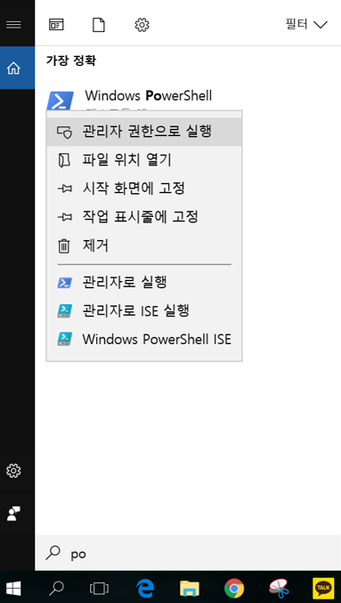

유징 소투스 윗 도커 포 윈도우
====
`이 문서는 hyperledger sawtooth 1.0을 docker for windows(18.03.01-ce-win65)에서 다루며 os는 window 10 pro임`

# 1. hyperledger sawtooth를 docker for window에서 돌릴수있게 해보자!

## 1. Docker for windows설치

[Install Docker for windows](https://docs.docker.com/docker-for-windows/install/) 

## 2. Starting Sawtooth

도커의 초기설정이 끝나고 도커를 켜기 전에
원하는 위치에 폴더를 생성합니다.

이후, 이 문서에 첨부되어있는 sawtooth-default.yaml을 
생성한 폴더에 다운받아 주세요.  
그다음 도커를 실행해보도록 하겠습니다.

powershell이든 cmd이든 상관없지만 이 문서에서는 
Windows PowerShell을 사용하도록 하겠습니다. 관리자 권한으로 실행해주세요.

