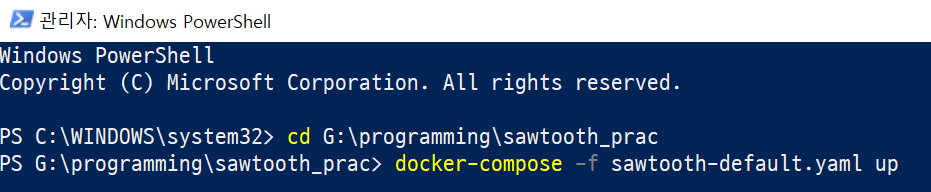
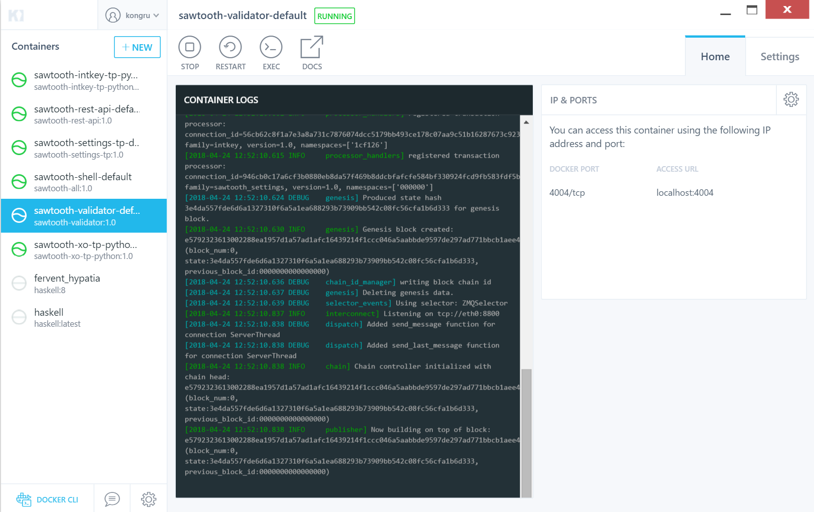
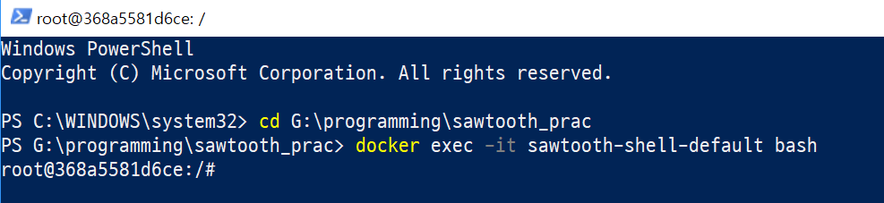
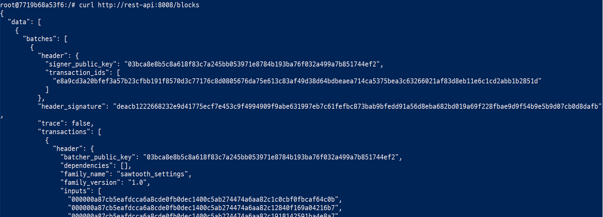
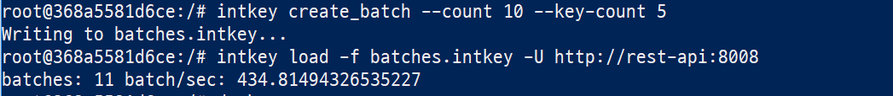

유징 소투스 윗 도커 포 윈도우
====
`이 문서는 hyperledger sawtooth 1.0을 docker for windows(18.03.01-ce-win65)에서 다루며 os는 window 10 pro임`

# 1. hyperledger sawtooth를 docker for window에서 돌릴수있게 해보자!

  

## 1. Docker for windows설치

[Install Docker for windows](https://docs.docker.com/docker-for-windows/install/) 

## 2. Starting Sawtooth

도커의 초기설정이 끝나고 도커를 켜기 전에
원하는 위치에 폴더를 생성합니다.  
이후, 이 문서에 첨부되어있는 sawtooth-default.yaml을 
생성한 폴더에 다운받아 주세요. 

그다음 도커를 실행해보도록 하겠습니다.

powershell이든 cmd이든 상관없지만 이 문서에서는 
Windows PowerShell을 사용하도록 하겠습니다.  
  

다음 커맨드를 실행하여 Sawtooth이미지를 다운받습니다. 주의 해야할 점은 이 커맨드를 사용할 폴더에 sawtooth-default.yaml이 있어야 합니다.  
~~~
% docker-compose -f sawtooth-default.yaml up
~~~

전부 다운이 받아지면 docker의 kitematic을 켜서 확인할 수 있습니다.

  
돌아가고있는것을 확인할 수 있습니다.  

## 3. Stopping Sawtooth

sawtooth를 종료하려면 `CTRL-c`를 몇 회 누른 뒤,  
~~~
% docker-compose -f sawtooth-default.yaml down
~~~
커맨드를 입력합니다. 이를 통해 완전히 종료할 수 있습니다.

## 4. Logging Into The Client Contatiner

이 커맨드를 통해 sawtooth가 실행중인 상태여야 합니다.
~~~
% docker-compose -f sawtooth-default.yaml up
~~~

sawtooth가 실행중인 상태에서 다음 커맨드를 통해 client container에 접근할 수 있습니다.
~~~
% docker exec -it sawtooth-shell-default bash
~~~
 
root~~~이런식으로 실행되면 성공입니다  

### Confirming Connectivity

Validator가 동작중인것을 확인하기 위해 root에서 `curl`커맨드를 사용할 수 있습니다.
~~~
/# curl http://rest-api:8008/blocks
~~~
만약 validator가 실행중이고 접근이 가능하다면 output은 이런식으로 비슷하게 출력될 것입니다.

 

만약 validator에 문제가 있다면 `curl`커맨드는 타임아웃하거나 아무것도 반환하지 않을것입니다.

## 5. Using Sawtooth Commands

### Creating and Submitting Transactions with intkey

`intkey` 커맨드는 간단한 샘플 트랜잭션을 생성하여 테스팅할수있게 합니다. `intkey`커맨드는 뭔가 엄청 중요한 커맨드가 아니라 단순히 테스팅하는 용도로 사용하는 커맨드라고 생각하면 조금 머리가 편해집니다.

다음 스텝은 `intkey`를 사용하여 intkey transactions의 랜덤값을 가진 몇개의 key로 구성된 배치파일을 생성하게됩니다. 이 배치파일은 로컬에 저장되고 validator에 전달합니다.
~~~
$ intkey create_batch --count 10 --key-count 5
$ intkey load -f batches.intkey -U http://rest-api:8008
~~~

 
