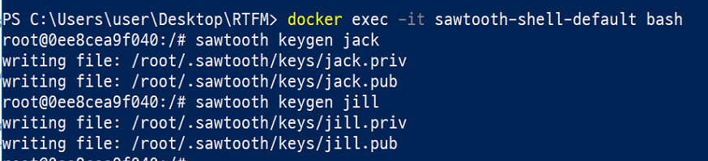
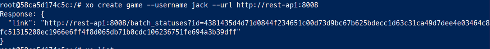

유징 소투스 윗 도커 뽀 윈도우
====
`이 문서는 hyperledger sawtooth 1.0을 docker for windows(18.03.01-ce-win65)에서 다루며 os는 window 10 pro임`

# 2. XO Transaction Family

### 1. XO게임?
XO는 Sawtooth SDK에 포함되어있는 transaction family 예제임. 쉽게 틱택토라고 생각하면 됨. 2인용 게임이며 보통 3x3크기의 테이블에 한명씩 돌아가면서 마킹을 하게 되고 1줄을 먼저 잇는사람이 우승하는 게임  
틱택토에 대해 더 자세한 설명은 [여기](https://namu.wiki/w/%ED%8B%B1%ED%83%9D%ED%86%A0) 

### 2. Playing XO with the XO Client

XO게임을 시작하기 전에 필요한것들  
1. 최소 하나의 validator
2. XO family transaction processor
3. The REST API

먼저 sawtooth를 실행해줍니다. 
~~~
% docker-compose -f sawtooth-default.yaml up
~~~

다음 `sawtooth-shell-default bash`를 실행해줍니다.
~~~
% docker exec -it sawtooth-shell-default bash
~~~

게임에 참여할 두명의 플레이어의 키를 생성합니다.
~~~
$ sawtooth keygen jack
$ sawtooth keygen jill
~~~

다음으로는 게임을 진행할 게임판을 생성해야합니다.
~~~
$ xo create game --username jack --url http://rest-api:8008 
~~~
username의 파라미터값으로 온 jack은 Player1이 됩니다.

