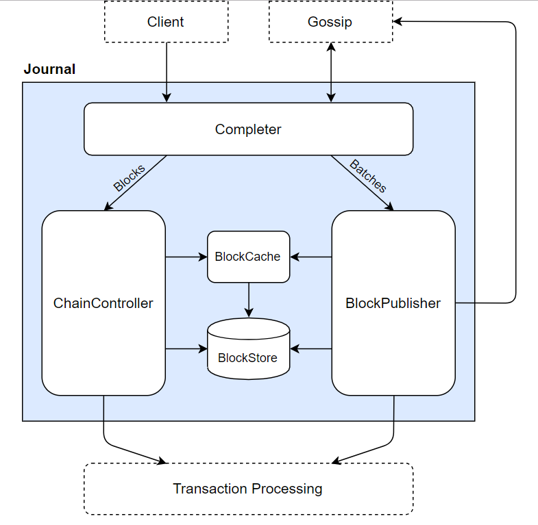

Journal
====

>원문 : [Journal](https://sawtooth.hyperledger.org/docs/core/nightly/master/architecture/journal.html)
>sawtooth 1.0.5

journal은 batch들과 제안된 블록들을 다루기 위한 validator component들의 그룹입니다. 이런 컴포넌트들은 블럭을 생성하고, 체인을 확장하기 위한 batch들 그리고 제안된 블록이 새로운 체인 헤드를 생성해도 좋은지에 대한 검증에 대한 책임이 있습니다.  

블럭과 batch들은 gossip프로토콜이나 클라이언트의 request를 통해 상호연결됩니다. 이러한 과정은 다중 pipeline을 통해 다뤄집니다.  

* `Completer`는 블록과 batch들을 가장 먼저 받게 됩니다. 블록과 batch들을 위한 모든 의존성이 만족하는지를 보장합니다.
* Completer를 통해 나온 batch들은(Completed batches) batch 검증과 블록에 포함시키기 위해 `BlockPublisher`로 가게됩니다.
* Completer를 통해 나온 block들은(Completed blocks) 검증과 fork문제 해결을 위해 `ChainController`로 가게 됩니다.
* `BlockCache`와 `BlockStore`는 위와같은 과정이 진행되는동안 batch들과 블럭들을 임시로 저장할 수 있는 공간을 제공합니다.  

일련의 과정들은 비동기로 진행되게 디자인되어있습니다. ChainController는 자신에게 오는 블록들을 병렬적으로 처리할 수 있게 됩니다. 또한 이러한 디자인은 BlockPublisher가 ChainController에게 가는 블록의 비율이 많아도 블록을 요청하는 작업을 계속할 수 있게합니다.  

이런 접근 방법은 서로 다른 합의알고리즘이 작동하는데 충분한 유연성을 제공합니다. Sawtooth는 journal안에서 component끼리 상호작용할 수 있는 consensus interface를 제공합니다.  

# The Completer

제안된 블록이 전파될 때 그 안에는 batch자체의 정보는  없고 batch의 ID같은 최소의 필요 정보만 담고 있습니다. Completer는 블록과 batch들이 BlockPublisher나 ChainController에 가기전에 완전하게 만들어주는 역할을 합니다.  

Completer는 먼저 이전블록이 존재하는지 의존성을 체크하고 또한 batch들이 BlockStore나 BlockCache에 있는지를 확실하게 합니다.  

* batch는 의존하고있는 트랜잭션이 최근 체인에 존재하는지 또는 BlockPublisher로 이동되었는지 확인되면 완전하다고 여겨집니다. batch가 완전하다고 여겨지면 ChainController로 이동하게 됩니다.
* 블록의 모든 프로시저가 ChainController로 이동되고 batch들의 field에 블록헤더에 명시된 모든 batch들을(batch의 ID형태로) 포함하고 있을 때 block을 완전하다고 여깁니다. 또한 batch들의 field는 batch의 리스트와 같은 order를 가지고 있어야 합니다. block이 완전하다고 여겨지면, 검증을 위해 ChainController로 이동하게 됩니다.  

모든 블록들과 batch들은 time-out을 가지고 있습니다. Completer가 존재하지 않는 의존성이나 프로세서에 최초 request를 보냈을때, 명시된 시간안에 답이 오지 않으면 block과 batch는 드롭됩니다.  

예를 들어, 체인 A->B->C를 생각해봅시다. 블록C가 도착했는데 B가 BlockCache에 없으면, Completer는 블록B를 요청하게 됩니다. 만약 B에 대한 요청이 timeout해버리면 블록C는 드롭됩니다.  

만약 나중에 블록D가 도착하면(A->B->C->D), Completer가 블록C에대한 요청을 네트워크에 보내게 됩니다. 그 후, 블록C가 도착하면 Completer는 블록B에 대한 요청을 다시 보내게 됩니다. 만약 블록B가 제시간에 도착하면 새로운 체인이 ChainController로 이동되게됩니다. 그곳에서 새로운 블록헤드를 만들어도 되는지 검증하는 작업을 하게 됩니다.  

# The BlockPublisher

BlockPublisher는 체인을 확장하기 위해 후보 블록을 생성하는 책임을 가지고 있습니다. BlockPublisher는 블록을 만드는데있어 모든 살림을 맡아서 처리하지만, 언제 블록을 생성하고 언제 발행할지는 합의 알고리즘의 지시를 따릅니다.  

BlockPublisher는 다음과 같은 이벤트에 반응합니다.
* Start block
* Receive batch
* Summarize block (stop&make the block avaliable)
* Finalize block (publish) 

# The ChainController

ChainController는 blockchain을 유지하는 책임을 지니고 있습니다. 제안된 블록을 검증하는 작업, 유효한 블록인지를 결정하는 작업, 체인을 확장하는 새로운 블록 생성에 관한 작업을 담당합니다.  

ChainController는 어떤 체인이 현재 validator에 속해있는지, 체인의 변경이 필요한 활동을 조정하게 됩니다.  

# The BlockStore

BlockStore는 현재 체인의 모든 블록을 저장하는 영구 디스크 저장소(persistent on-disk store)입니다. 즉, 현재 체인헤드의 블록리스트들은 제네시스블록의 뒤로 들어가게됩니다.(fork때문에 생긴 블록은 BlockStore에 저장되지 않습니다) validator가 시작되면, BlockStore의 내용은 현재 "블록체인의 상태"로써 신뢰할 수 있게 됩니다. 정식으로 완전한 블록만이 이곳에 저장될 수 있기 때문입니다.  

또한 BlockStore는 transaction-to-block과 batch-to-block에 관한 내부적인 매핑작업을 관리합니다. 이러한 매핑작업은 (startup하는 도중이라거나 일반적인 작업순서가 아닐때 종종 발생하는) 오류나 무언가 빠졌을때 다시 빌드할 수 있게 합니다. 디스크에 캐시되어 저장되며 언제나 메모리가 공개되는것은 아닙니다. 블록체인이 성장할때마다 기록되며 그에따라 매핑도 꽤 커지게 됩니다.  

BlockStore는 (fork가 변경되었을 때)현재 체인을 업데이트하는 메소드(atomic method)를 제공합니다. 블록체인이 fork를 전환하려면, BlockStore는 커밋될 새로운 체인의 블록리스트를 제공하고 사라질 오래된 체인의 블록리스트를 제공합니다. 이 두개의 리스트는 각 fork를 공통루트로 명시되게 됩니다.  

BlockStore안의 블록은 블록ID로 접근할 수 있으며 또한 batch ID와 transaction ID와 블록 번호로도 접근할 수 있습니다.  

>BlockStore는 항상 일관되어야 합니다. BlockStore안의 에러는 복구할 수 없는 문제로 여겨집니다. block이나 체인 reference를 찾을 수 없거나 인덱싱이 잘못되었거나, 블록이 invalid 또는 미완성일 때를 심각한 오류라고 정의합니다.

# The BlockCache

BlockCache는 시스템이 시작될 때 재구성되는 메모리입니다. validator가 블록을 다룰 때 임시저장하는 공간입니다.  

BlockCache는 각 블록이 유효한지, 아닌지, 언노운인지 각 상태를 추적합니다. 
* 블록이 유효한지는 ChainController에 의해 증명됩니다. BlockStore안의 모든 블록은 모두 유효하다고 여겨집니다.
* 유효하지 않은 블록은 검증이 실패할 때 유효하지 않다고 여겨집니다.
* 언노운 블록은 아직 검증이 끝나지 않은 블록을 말합니다. 주로 이러한 블록은 Completer에 바로 도착했을때 일컬어집니다.

만약 블록이 BlockCache에서 발견할 수 없다면, validator는 BlockStore를 찾아봅니다. 만약 이곳에서도 찾지 못한다면 언노운이라고 마킹됩니다. 만약 블록을 BlockStore에서 찾는다면 BlockCache로 불리고 유효하다고 마킹됩니다.  

BlockCache는 현재 블록이 적절한지를 최근 블록에 접근한 이력을 추적함으로써 유지합니다. 주기적으로 접근되지 않은 블록은 BlockCache에서 제거되지만, 해당 블록이 다른블록에서 참조하지 않을 때만 제거할 수 있습니다.

# The Consensus Interface

Sawtooth는 `dynamic consensus`를 제공합니다. 블록체인을 위한 첫번째 합의는 제네시스 블록을 생성할때 이뤄집니다. 이는 Setting transaction processor를 통해 첫번째 합의가 언제 일어날지 변경할 수 있습니다.  

consensus interface는 합의 룰에 따라 블록이 유효한지, 발행해도 되는지, fork상황에서 어떤 블록이 체인 헤드가 되는지 결정하는 역할을 합니다.  

이 섹션의 초반에서 설명하였듯이, validator는 블록을 생성, 커밋, 피어와 다른 노드들간의 네트워크연결등의 역할을 다룹니다.  

# The Genesis Process

제네시스 블록을 생성하는 과정은 일반 블록을 생성하는 과정과 약간 다릅니다.  

제네시스 블록(블록체인의 루트)은 새로운 sawtooth네트워크를 만들기 위해 반드시 필요하다. 배포 관련 구성설정이나 애플리케이션 관련 트랜잭션들은 이러한 초기과정이 필요하다.  

제네시스 블록은 validator가 빈 블록체인을 시작할때 만들어진 batch들의 리스트를 포함하고있다. 이것은 애플리케이션(transaction families)으로 하여금 초기생성과정을 자세히 몰라도 자신의 batch들을 소유할 수 있게 됩니다.  

초기생성과정은 다음과 같습니다.
1. 최초 블록체인 트랜잭션의 제네시스 batch 생성
2. 제네시스 batch에서 제네시스 block을 생성
3. transaction processor 시작
4. 제네시스 block 과정

## Genesis Batch Creation

`sawadm genesis` 커맨드는 batch들의 집합을 인풋으로 하여 그것들을 합쳐 제네시스 batch를 생성합니다.  

File: sawtooth-core/protos/genesis.proto
~~~java
message GenesisData {
    repeated Batch batches = 1;
}
~~~

제네시스 블록안의 batch들은 순서대로 실행됩니다. 각 batch는 암묵적으로 이전 batch에 의존적입니다. `sawadm genesis` 커맨드는 의존성이 존재하는지 확인하는 리스트가 생성될 때 의존성을 체크합니다.  

만약 애플리케이션이 제네시스블록의 트랜잭션 집합을 포함시켜야 할 때, 올바른 순서로 GenesisData목록을 생성하는 도구를 제공해야 합니다. 필요하다면 이 툴은 batch와 transaction의 의존성을 명시적으로 관리할 수도 있습니다.  

다음 예시는 `sawset proposal create` 커맨드를 사용해서 PoET 합의 알고리즘을 구성하는 transaction의 batch를 생성하는 코드입니다. 다음으로는 `sawadm genesis` 커맨드를 사용해 제네시스 블록의 GenesisData 리스트에 들어갈 batch를 합치는 코드입니다.  

~~~
$ sawset proposal create \
  -k <signing-key-file> \
  -o sawset.batch \
  sawtooth.consensus.algorithm=poet \
  sawtooth.poet.initial_wait_timer={value} \
  sawtooth.poet.target_wait_time={value} \
  sawtooth.poet.population_estimate_sample_size={value}

$ sawadm genesis sawset.batch
~~~

`sawadm genesis`가 실행될 때, `genesis.batch`파일에 쓰게 됩니다.  

>PoET를 사용한 네트워크는 제네시스 batch에 부가적인 batch를 추가해야합니다. 더 많은 정보는 [여기](https://sawtooth.hyperledger.org/docs/core/nightly/master/app_developers_guide/creating_sawtooth_network.html#proc-multi-ubuntu-label)를 봐주세용  

## Genesis Block Creation

제네시스 batch가 생성되고 나면, 다음 과정을 통해 제네시스 블록을 생성하게 됩니다.  
1. validator가 시작되고 나서, 다음 조건이 참임을 따집니다.
    * `genesis.batch`파일의 존재
    * 체인 헤드로 명시될만한 블록이 없음 
    만약 두 조건중 하나라도 거짓이 나온다면 작업을 중단합니다.
2. validator가 pending queue에 들어있던 `genesis.batch`에서 batch들을 로드합니다.
3. validator는 다음 기준에 따라 제네시스 블록을 생성합니다.
    * batch의 실행순서는 반드시 GenesisData 리스트 안에 들어있는 순서대로 실행되어야합니다. [Executor](https://sawtooth.hyperledger.org/docs/core/nightly/master/architecture/scheduling.html#txn-sched-executor-label)는 batch의 순서를 조정하거나 실패된 트랜잭션을 제거하지 않습니다. 만약 `genesis.batch`파일 중 아무 트랜잭션이든 실패하면 제네시스 블록은 생성되지 않습니다. validator는 이 오류를 Fatal Error로 처리합니다.
    * validator는 합의 알고리즘을 고려하지 않고 블록의 유효성을 검증합니다. 제네시스 블록이 생성되기 시작하는 시점에서 상태(머클트리)는 비어있고 이에따라 블록체인에는 어떤 합의 알고리즘도 존재하지 않기 때문입니다. 결과적으로 제네시스 블록은 합의 field가 비어있습니다.  
4. validator는 블록체인의 ID(genesis block의 서명)을 `block-chain-id` 파일로 validator의 data directory에 추가합니다. 블록체인 ID는 블록체인에서 validator의 제네시스 블록이 올바른지 표시하는데 사용됩니다.  

## Genesis Block Processing

초기과정과 제네시스 블록 커밋을 완료하기 위해서 필요한 모든 transaction processor는 돌아가야 합니다.  

만약 제네시스 블록에 담긴 어떤 트랜잭션이 세팅을 설정하거나 변경하면, Sawtooth는 Sawtooth Setting Transaction processor가 필요합니다. 예를들어 만약 제네시스블록에서 PoET 합의알고리즘의 구성을 세팅하는 트랜잭션이 존재한다면 트랜잭션 프로세서는 반드시 PoET세팅을 다룰 수 있는 프로세서여야합니다.(아무런 합의알고리즘을 명시하지 않았다면 Sawtooth는 dev mode consensus를 사용합니다.)  

제네시스블록이 커밋되고나서 합의에 대한 설정이 상태에 저장되게 됩니다. 차후 블록들은 합의알고리즘에 의해 진행되게 됩니다.

---

---

</img>