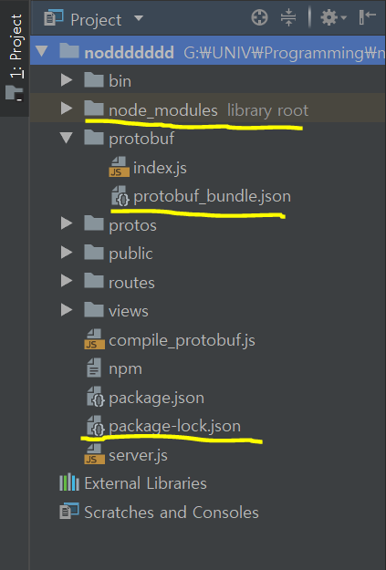

유징 소투스 윗 도커 뽀 우분뚜
====
`이 문서는 hyperledger sawtooth 1.0.4을 docker for ubuntu(18.03.01-ce)에서 다루며 os는 ubuntu-18.04 LTS임`

# 9. Building and Submitting Transactions with js

## 1. Overview
이번 문서에서는 자바스크립트 코드로 트랜잭션을 만들고, validator에 제출해보도록 하겠습니다.  
>node.js사용

## 2. Prerequisites

[이전 문서](https://github.com/GRuuuuu/sawtooth-starter/blob/master/sawtooth/%238%20configuring%20permission/Configuring%20Permission.md)에서 했던 과정을 그대로 따라해주시고 `docker-compose`커맨드로 sawtooth를 실행시켜주시기 바랍니다.  

같은 폴더 안에 있는 package.json과 compile_protobuf.js파일, protobuf폴더와 protos폴더를 클론받아 프로젝트에 추가시켜주세요.

## 3. Install Package

cmd창에서 다음 커맨드를 통해 패키지를 설치합니다.
~~~
npm install
~~~
패키지를 설치하고 나면 프로젝트 구조는 다음과 같이 구성됩니다.

  
node_moudules에는 package.json에 기재되어있던 의존모듈이 추가되고 `scripts`의 `prepublish`를 통해 compile_protobuf.js가 컴파일되고 `payload`를 인코딩할 수 있는 protobuf_bundle.json이 추가됩니다.

## 4. protobuf_bundle.json

protobuf_bundle.json파일은 compile_protobuf.js파일을 컴파일함으로써 protos폴더 안의 proto파일을 json형식으로 나타낸 것입니다. 이를 통해 Payload가 어떤식으로 구성되어야하는지를 알 수 있게됩니다.  

proto 파일에 대한 정보는 [여기](https://developers.google.com/protocol-buffers/docs/overview)

## 5. Payload 구성

>Payload를 구성함에 있어 가장 주의깊게 봐야할 부분은 `Encoding`하는 부분입니다. 모든 트랜잭션 패밀리에서 payload를 parsing하는 방법이 다르기 때문에 보내는 방법도 각양각색입니다.  
>반드시 참고해야할 트랜잭션 패밀리의 핸들러 소스코드와 `proto`파일을 읽어보셔야합니다.

### 5.1 Intkey
intkey 트랜잭션 패밀리는 payload를 `CBOR`로 encoding하고 json형식으로 작성해야합니다.

~~~javascript
const cbor = require('cbor')
const payload = {
    Verb: 'set',
    Name: 'foo',
    Value: 42
}
const payloadBytes = cbor.encode(payload)
~~~

### 5.2 Xo
Xo 트랜잭션 패밀리는 payload를 작성하는 방법이 `Intkey`와는 사뭇 다릅니다. payload를 핸들링하는 [소스코드](https://github.com/hyperledger/sawtooth-core/blob/master/sdk/examples/xo_python/sawtooth_xo/processor/xo_payload.py)를 참고하면서 봐주세요.  
~~~python
class XoPayload:

    def __init__(self, payload):
        try:
            # The payload is csv utf-8 encoded string
            name, action, space = payload.decode().split(",")
        except ValueError:
            raise InvalidTransaction("Invalid payload serialization")
    ...
~~~
xo트랜잭션의 payload를 핸들링하는 소스코드의 일부입니다. try문 안을 보면 `name`, `action`, `space`의 순서대로 "`,`"를 기준으로 parsing하고 있습니다.  

xo 트랜잭션의 payload를 구성할 때는 `json`형식으로 구성한다면 `InvalidTransaction` 에러가 뜰 수 밖에 없습니다.  
~~~javascript
    const payload = "game1,create,";
    const payloadBytes = cbor.encode(payload);
~~~
위와 같이 페이로드를 구성하면 됩니다.

### 5.3 Identity

세 번째 예시는 Identity 트랜잭션 패밀리입니다. 제가 예시를 들어볼 트랜잭션은 policy를 생성하는 트랜잭션입니다.  

>Identity 트랜잭션을 만드려면 `npm install`하기전에 protos 폴더에 identities.proto 파일이 존재해야합니다.  
>sawtooth-core의 protos폴더에는 identities.proto파일이 존재하지 않고, [여기](https://github.com/hyperledger/sawtooth-core/tree/master/families/identity/protos)에 있으니 참고하시기 바랍니다. 현재 문서의 protos 폴더에는 identities.proto를 추가시켜놨습니다.

>단순히 require("protobuf")를 하게 되면, `node_modules`를 참조하게 됩니다. 하지만 우리는 identities.proto를 임의로 추가시켜 protobuf_bundle파일을 생성했으니 `node_modules`가 아닌 로컬의 protobuf파일을 참조하게 해야합니다.  
>
>따라서 이와같이 작성하여야 합니다. 
>~~~javascript
>const {Policy,IdentityPayload,TransactionHeader,Transaction,BatchHeader,Batch,BatchList} = require("../protobuf");
>~~~
>

protobuf_bundle.json 파일로 가서 payload를 만들기 위한 양식을 찾아봅시다. Policy나 Role을 세팅하기 위한 json 포맷은 다음과 같습니다.

~~~json
    "IdentityPayload": {
      "fields": {
        "type": {
          "type": "IdentityType",
          "id": 1
        },
        "data": {
          "type": "bytes",
          "id": 2
        }
      },
      "nested": {
        "IdentityType": {
          "values": {
            "IDENTITY_TYPE_UNSET": 0,
            "POLICY": 1,
            "ROLE": 2
          }
        }
      }
    },
~~~
먼저 최종적으로 `IdentityPayload`에 들어가야할 내용은 type과 data입니다. type은 `IdentityType`을 참고하고 있고, `IdentityType`은 하단의 nested안에서 확인할 수 있습니다.  
제가 예시로 들 내용은 policy를 세팅하는 것이니 type은 1이 될 것입니다.  

다음으로는 data입니다. data에는 policy에 세팅할 정보가 들어가게 될 것입니다.
~~~json
    "Policy": {
      "fields": {
        "name": {
          "type": "string",
          "id": 1
        },
        "entries": {
          "rule": "repeated",
          "type": "Entry",
          "id": 2
        }
      },
      "nested": {
        "EntryType": {
          "values": {
            "ENTRY_TYPE_UNSET": 0,
            "PERMIT_KEY": 1,
            "DENY_KEY": 2
          }
        },
        "Entry": {
          "fields": {
            "type": {
              "type": "EntryType",
              "id": 1
            },
            "key": {
              "type": "string",
              "id": 2
            }
          }
        }
      }
    },
~~~
Policy는 name과 entries가 필요합니다. name은 String형, entries는 Entry형이고 반복될수있습니다.  

다음과 같은 커맨드는
~~~
$ sawtooth identity policy create p1_name "PERMIT_KEY *" 
~~~

이렇게 구성될 수 있습니다.
~~~javascript
    const policyBytes = Policy.encode({
        name: "p1_name",
        entries: [
            {
                type: 1,   //PERMIT_KEY
                key: "*"
            }
        ]
    }).finish();

    const payloadBytes = IdentityPayload.encode({
        type : 1,          //policy
        data : policyBytes
    }).finish();
~~~
CBOR을 사용하지 않고, protocol buffer의 encode를 사용하고 있습니다.

>identity는 트랜잭션을 보낼 때 allowed_key로 정해진 key만 sign이 가능합니다.

## 6. Signer

공식 문서의 [예시](https://sawtooth.hyperledger.org/docs/core/nightly/master/_autogen/sdk_submit_tutorial_js.html)에서는 랜덤으로 privateKey를 생성하여 트랜잭션과 배치에 서명하게 되어있습니다.  
특정 privateKey로 서명하고 싶다면 다음과 같이 하면 됩니다.

~~~javascript
        const context = createContext("secp256k1"); //암호화 컨텍스트
        
        const privateKey = Secp256k1PrivateKey.fromHex("8a0d61af0a9518bcf4d60f013edc5da6876fcd4dad9ee0f3a832a0c67122faae");
        const signer = new CryptoFactory(context).newSigner(privateKey);
~~~

## 7. Transaction Header
트랜잭션의 헤더는 다음과 같이 작성할 수 있습니다.
~~~javascript
    const transactionHeaderBytes = TransactionHeader.encode({
        familyName: "sawtooth_identity",      //보내려는 트랜잭션의 패밀리 네임
        familyVersion: "1.0",
        inputs: ["000000", "00001d"],         //input : read from
        outputs: ["00001d"],                  //output : write to
        test: signer.getPublicKey(),
        signerPublicKey: signer.getPublicKey(privateKey).asHex(),
        // In this example, we're signing the batch with the same private key,
        // but the batch can be signed by another party, in which case, the
        // public key will need to be associated with that key.
        batcherPublicKey: signer.getPublicKey(privateKey).asHex(),
        // In this example, there are no dependencies.  This list should include
        // an previous transaction header signatures that must be applied for
        // this transaction to successfully commit.
        // For example,
        // dependencies:['540a6803971d1880ec73a96cb97815a95d374cbad5d865925e5aa0432fcf1931539afe10310c122c5eaae15df61236079abbf4f258889359c4d175516934484a'],
        dependencies: [],
        payloadSha512: createHash("sha512").update(payloadBytes).digest("hex")
    }).finish();
~~~

input과 output에 관한 정보는 [여기](https://github.com/hyperledger/sawtooth-core/blob/master/cli/sawtooth_cli/identity.py)의 line 49처럼 define된 변수가 있거나 공식문서의 트랜잭션패밀리를 다룬 [부분](https://sawtooth.hyperledger.org/docs/core/nightly/master/transaction_family_specifications/identity_transaction_family.html)의 Addressing을 확인하면 됩니다.

  
만약 input과 output을 틀리게 적었다면 위와같은 오류가 발생합니다.

이 뒤의 내용은 공식문서의 예시와 같으니 참고하시면 됩니다.  

## 8. 마치며

수고하셧읍니다^^7 점점 새로 공부해야하는 내용이 많아지네요. 다음 문서는 뭐로 작성하면 좋을지 고민중..

---

---

</img>