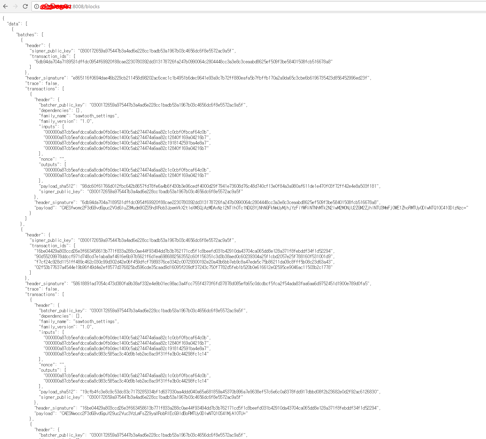
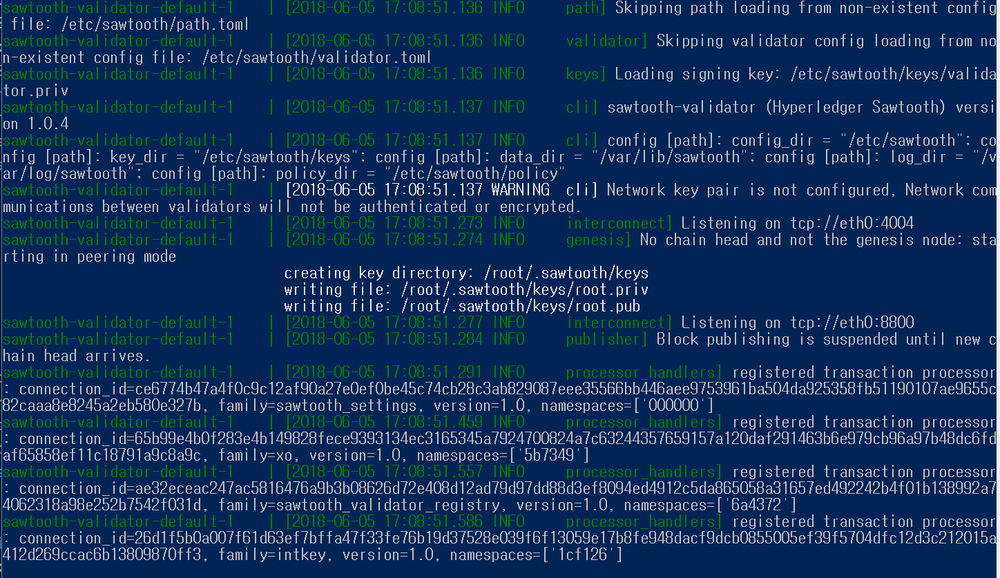
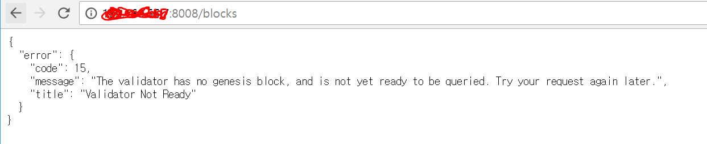

유징 소투스 윗 도커 뽀 윈도우
====
`이 문서는 hyperledger sawtooth 1.0.4을 docker for windows(18.03.01-ce-win65)에서 다루며 os는 window 10 pro임`

# 6. Connect multi validator in Remote network

## 1. Overview
이번 문서에서는 서로다른 네트워크에서 validator를 연결해보도록 하겠습니다. 

## 2. Prerequisites

이전문서에서는 validator 2개를 로컬환경에서 연결하는 작업을 했었음. 이번 문서의 작업을 제대로 이해하기 위해서는 이전문서를 꼭 읽어보고 오시기 바랍니당

먼저 [제네시스블럭을 생성하는 YAML]()과 [기타 validator의 YAML]()을 다운로드 받아주세요

>이 문서는 포트를 다루고 있기 때문에 로컬환경에서 작업하던 이전 문서와 달리 예상치못한 네트워크 관련 문제가 (매우)많이 생길 수 있습니다.  
실제로 매우매우매우 고생했기 때문에...몇가지 해결방법을 미리 기술합니다.
>
> 1. 방화벽을 확인한다. 방화벽 고급설정의 인바운드 아웃바운드 규칙을 만들어줍시다.
> 2. yaml파일의 bind와 endpoint, seeds 그리고 connect 부분을 확인합니다.
> 3. 사용하는 공유기 또는 컴퓨터의 환경에 따라서 컴퓨터 자체의 로컬ip와(자기 자신을 가리키는) 외부에서 자신을 가리키는 ip가 다를 수 있습니다. 이런 경우에는 yaml파일에서는 자기자신을 가리키는 로컬ip를 사용해야하고 외부에서 블럭의 내용을 볼 때는 외부ip를 사용합니다.
> 4. 공유기를 사용하는 경우-> 일부 공유기는 특정 포트를 막아놓는 경우가 있습니다. 포트포워딩으로 뚫어줍시다.
> 5. 다했는데 안된다 -> 끄고 자면됨 -> 행복

## 3. 일단 실행

다운로드받은 yaml파일이 있는 폴더로 이동해서 shell(이하 shell-1)에서 다음 커맨드를 쳐봅시다
~~~
docker-compose -f sawtooth-default-poet.yaml up
~~~
yaml파일에 미리 기록해두었던 이미지들이 실행될겁니다. 정상적으로 실행된다면 다음과같은 화면이 보일거에요. 

### 연결확인

지금 켜져있는 shell-1을 끄지말고(로그 확인용) 하나 더켜서(이하 shell-2) bash를 실행
~~~
docker exec -it sawtooth-shell-default bash
~~~

`curl`커맨드로 peer가 제대로 연결되었는지 확인해봅시다.
~~~
curl http://sawtooth-rest-api-default-0:8008/peers
~~~

data에 validator-1이 존재하는 것을 확인할 수 있습니다.  
이는 validator-0(제네시스 블럭)과 validator-1이 연결되어 있다는 의미입니다.

### xo게임 실행

두개의 validator 실행에 성공하였다면 xo게임생성을 통해 블럭이 쌓이는 모습을 확인해보겠습니다.
~~~
이전 문서를 참고해서 키 만들고 xo게임생성 ㄱㄱ
xo create example --username a --url http://rest-api-0:8008
~~~
>이전 문서에서는 단순히 rest-api:8008만 했지만 yaml 파일을 생성할때 validator0번의 rest-api가 rest-api-0으로 명명되었으므로 이렇게 작성해 주어야함 

실행하게되면 shell-2에는 Response가 오게될 것

이전에 띄워놓았던 shell-1을 확인해보면 validator 1개를 쓸 때보다 많은양의 로그가 기록되어있는것을 확인할 수 있음. 두개의 validator 모두 검증작업을 진행하기 때문이다.  
>로그의 내용은 따로 설명하지 않을 것. 읽으면 자연스레 알게되는 내용★

두개의 validator 모두 게임이 정상적으로 생성된 것을 확인할 수 있음!

## 4. YAML파일 뜯어보기

### validator

~~~
  validator-0:                                      //제네시스 블럭
    image: hyperledger/sawtooth-validator:1.0       //이미지 이름
    container_name: sawtooth-validator-default-0    //컨테이너 이름
    expose:                                         //사용할 포트
      - 4004
      - 8800
    command: "bash -c \"\                           //제네시스블럭을 생성
        sawadm keygen --force && \
        sawset genesis \
          -k /etc/sawtooth/keys/validator.priv \
          -o config-genesis.batch && \
        sawset proposal create \
          -k /etc/sawtooth/keys/validator.priv \
          sawtooth.consensus.algorithm=poet \
          sawtooth.poet.report_public_key_pem=\
          \\\"$$(cat /etc/sawtooth/simulator_rk_pub.pem)\\\" \
          sawtooth.poet.valid_enclave_measurements=$$(poet enclave measurement) \
          sawtooth.poet.valid_enclave_basenames=$$(poet enclave basename) \
          -o config.batch && \
        poet registration create -k /etc/sawtooth/keys/validator.priv -o poet.batch && \
        sawset proposal create \
          -k /etc/sawtooth/keys/validator.priv \
             sawtooth.poet.target_wait_time=5 \
             sawtooth.poet.initial_wait_time=25 \
             sawtooth.publisher.max_batches_per_block=100 \
          -o poet-settings.batch && \
        sawadm genesis \
          config-genesis.batch config.batch poet.batch poet-settings.batch && \
        sawtooth-validator -v \                    //validator 설정
          --bind network:tcp://eth0:8800 \         //bind : 포트를 고정시킴
          --bind component:tcp://eth0:4004 \
          --peering dynamic \                      //동적으로 peer를 붙임
          --endpoint tcp://validator-0:8800 \      //작업이 실제로 수행되는 지점
          --scheduler serial \                     //스케줄링은 serial하게(병렬도 있음)
          --network trust                          //신뢰하는 네트워크만
    \""
    environment:                                   //환경변수
      PYTHONPATH: "/project/sawtooth-core/consensus/poet/common:\
        /project/sawtooth-core/consensus/poet/simulator:\
        /project/sawtooth-core/consensus/poet/core"
    stop_signal: SIGKILL                          //종료는 ctrl+c

  validator-1:                                    //제네시스 블럭에 붙을 1번노드   
    image: hyperledger/sawtooth-validator:1.0 
    container_name: sawtooth-validator-default-1
    expose:
      - 4004
      - 8800
    command: |                                    //제네시스 블럭과 달리 블럭을  
      bash -c "                                   //생성할 필요가 없음!!!
        sawadm keygen --force && \
        sawtooth-validator -v \
            --bind network:tcp://eth0:8800 \
            --bind component:tcp://eth0:4004 \
            --peering dynamic \
            --endpoint tcp://validator-1:8800 \
            --seeds tcp://validator-0:8800 \      //붙을 노드의 ip(로컬에서는 이름)
            --scheduler serial \
            --network trust
      "
    environment:
      PYTHONPATH: "/project/sawtooth-core/consensus/poet/common:\
        /project/sawtooth-core/consensus/poet/simulator:\
        /project/sawtooth-core/consensus/poet/core"
    stop_signal: SIGKILL
~~~

### rest-api외 다른 이미지들
~~~
  rest-api-0:                                      //validator에 붙일 이미지의 이름
    image: hyperledger/sawtooth-rest-api:1.0
    container_name: sawtooth-rest-api-default-0
    expose:
      - 4004
      - 8008
    command: |
      bash -c "
        sawtooth-rest-api \
          --connect tcp://validator-0:4004 \      //반드시 해당 블럭의 validator에 connect
          --bind rest-api-0:8008"
    stop_signal: SIGKILL

  rest-api-1:
    image: hyperledger/sawtooth-rest-api:1.0
    container_name: sawtooth-rest-api-default-1
    expose:
      - 4004
      - 8008
    command: |
      bash -c "
        sawtooth-rest-api \
          --connect tcp://validator-1:4004 \
          --bind rest-api-1:8008"
    stop_signal: SIGKILL
    
    ...

  xo-tp-0:
    image: hyperledger/sawtooth-xo-tp-python:1.0
    container_name: sawtooth-xo-tp-python-default-0
    expose:
      - 4004
    command: xo-tp-python -vv -C tcp://validator-0:4004
    stop_signal: SIGKILL

  xo-tp-1:
    image: hyperledger/sawtooth-xo-tp-python:1.0
    container_name: sawtooth-xo-tp-python-default-1
    expose:
      - 4004
    command: xo-tp-python -vv -C tcp://validator-1:4004
    stop_signal: SIGKILL
   
    //나머지 이미지들도 비슷
~~~

## 5. 마치며

여러개의 validator를 로컬 서버안에서 다뤄보는 작업을 하였고, 다음 문서에서는 서로 다른 네트워크상에서 validator를 이어보는 작업을 해볼것

---

---

</img>